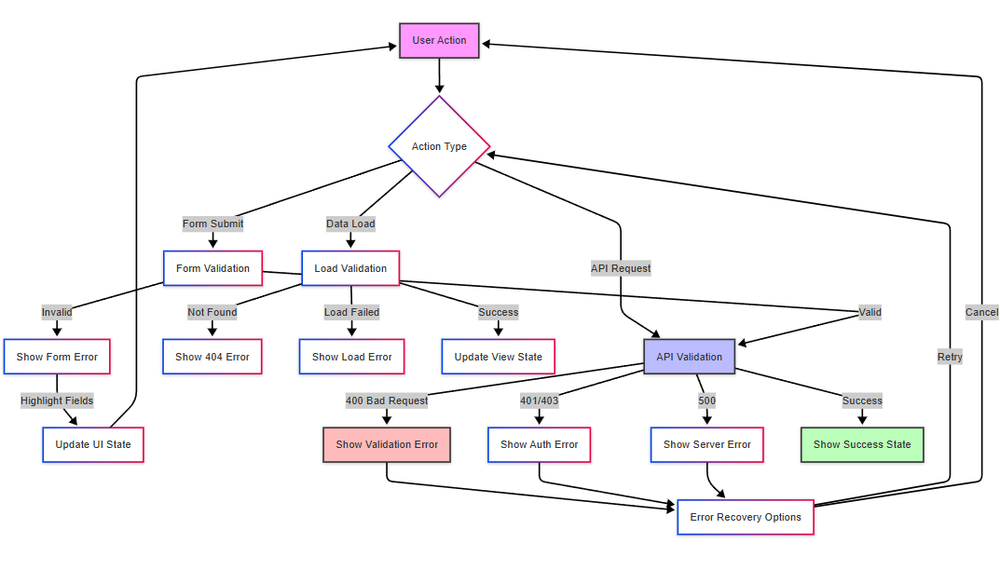

# Data Flow Architecture

## Overview

The application follows a clear data flow pattern from user interaction to database storage and back to the UI. Here's a detailed breakdown of how data moves through the system.

## Form Submission Flow


The diagram above illustrates the complete flow of data when a user submits a daily entry:
1. User fills out the Daily Entry Form
2. Form validation occurs
3. Valid data is submitted to the API route
4. Prisma Client processes the data
5. Data is stored in PostgreSQL
6. Success/error handling occurs
7. On success:
   - Form is cleared
   - localStorage is cleared
   - User is redirected to dashboard
8. On error:
   - Error message is shown
   - User can correct and resubmit

## Dashboard Data Loading


The diagram above illustrates how data flows through the dashboard:
1. User visits the dashboard page
2. Server Component (DashboardPage) handles the request
3. Data fetching:
   - getDashboardData function is called
   - Prisma Client queries the database
   - PostgreSQL returns the last 30 entries
   - Data is formatted for components
4. Component rendering:
   - Goal Achievement displays overall progress
   - Daily Goals Progress shows current metrics via Progress Rings
   - Weekly Overview visualizes trends through Chart.js Graphs
   - Gym Progress Tracker shows exercise improvements
   - Latest Entry displays most recent data

## State Management


The diagram above illustrates how state is managed throughout the application:

1. **User Interaction Types**
   - Form Input: Updates form state with validation
   - Form Submit: Processes data and updates multiple states
   - View Dashboard: Loads and updates dashboard-related states
   - Navigation: Manages route changes and state loading

2. **Form State Handling**
   - Updates form state on user input
   - Validates data before submission
   - Handles success/error states
   - Different behavior for Create vs Edit modes:
     - Create: Persists to localStorage
     - Edit: Maintains in memory only

3. **Dashboard State Management**
   - Loads server data on dashboard view
   - Updates multiple component states:
     - Charts state for visualizations
     - Progress state for metrics
     - Latest entry state for recent data

4. **Navigation State Flow**
   - Updates route on navigation
   - Loads required state based on page
   - Checks localStorage for form data
   - Initializes empty state when needed

This state management approach ensures data persistence between sessions, handles errors gracefully, and maintains a smooth user experience across the application.

## Data Persistence Layers

1. **Temporary Storage**
   - Form state (React useState)
   - localStorage for form persistence
   ```typescript
   // Form state initialization
   const [formData, setFormData] = useState<DailyEntryFormData>(() => {
     const saved = localStorage.getItem(STORAGE_KEY);
     return saved ? JSON.parse(saved) : defaultState;
   });
   ```

2. **API Layer**
   - Route: `/api/daily-entry`
   - Methods: POST, PUT, DELETE
   - Handles data validation and transformation
   ```typescript
   // API route handling
   export async function POST(request: Request) {
     const body = await request.json();
     // Validation and database operations
   }
   ```

3. **Database Layer**
   - Prisma ORM
   - SQLite database
   - Related tables:
     - DailyEntry
     - SupplementLog
     - GymSession
     - GymExercise

## Error Handling Flow



The diagram above illustrates the comprehensive error handling system in the application:

1. **Error Types by Action**
   - Form Submit:
     - Form validation errors with field highlighting
     - UI state updates for user feedback
   - Data Load:
     - 404 Not Found errors for missing resources
     - Load failures with error messages
     - Successful view state updates
   - API Request:
     - 400 Bad Request for validation errors
     - 401/403 for authentication/authorization errors
     - 500 for server errors
     - Success states with confirmations

2. **Error Recovery**
   - Each error type has recovery options
   - Users can retry failed operations
   - Cancel option returns to initial state
   - Clear error recovery paths for user experience

3. **Validation Layers**
   - Client-side form validation
   - Load validation for data requests
   - API validation for server requests
   - Each layer provides specific error feedback

This multi-layered error handling approach ensures:
- Clear user feedback
- Multiple recovery paths
- Graceful error states
- Consistent error messaging

## Real-time Updates

1. **Form Updates**
   - Immediate UI feedback
   - Progress indicators
   - Validation messages

2. **Dashboard Updates**
   - Auto-refresh on new entries
   - Progress calculations
   - Chart rerendering

## Data Transformation


The diagram above illustrates how data is transformed as it flows through the system:

1. **Input Processing**
   - Raw form data undergoes initial type validation
   - Data normalization ensures consistent format
   - Structured form data is prepared for specific type handling

2. **Type-Specific Transformations**
   - Numbers: Parsed into appropriate Float/Int types
   - Dates: Converted to ISO format for standardization
   - Arrays: Mapped and transformed for consistent structure

3. **Storage Pipeline**
   - Data is formatted for API transmission
   - Prisma schema validation and typing
   - Final database storage format

4. **Output Processing**
   - Query results are retrieved from database
   - Data processing for different display needs:
     - Charts: Formatted for Chart.js visualization
     - Progress: Converted to UI metrics
     - History: Transformed into timeline data

This transformation pipeline ensures:
- Type safety throughout the application
- Consistent data formats
- Efficient storage and retrieval
- Appropriate formatting for different UI components

The system maintains data integrity while providing flexible output formats for various display requirements.
