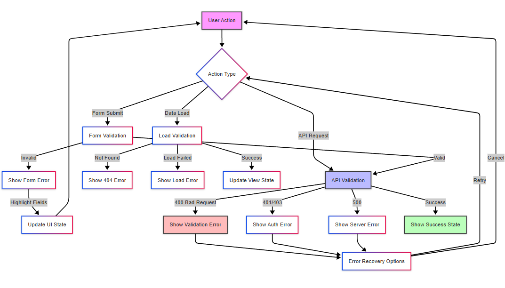

# Error Handling

## Overview

The application implements a comprehensive error handling system that manages errors across all layers of the application, from form validation to API responses and data processing.

## Error Flow

The diagram above illustrates the comprehensive error handling system in the application:

1. **Error Types by Action**
   - Form Submit:
     - Form validation errors with field highlighting
     - UI state updates for user feedback
   - Data Load:
     - 404 Not Found errors for missing resources
     - Load failures with error messages
     - Successful view state updates
   - API Request:
     - 400 Bad Request for validation errors
     - 401/403 for authentication/authorization errors
     - 500 for server errors
     - Success states with confirmations

2. **Error Recovery**
   - Each error type has recovery options
   - Users can retry failed operations
   - Cancel option returns to initial state
   - Clear error recovery paths for user experience

3. **Validation Layers**
   - Client-side form validation
   - Load validation for data requests
   - API validation for server requests
   - Each layer provides specific error feedback

This multi-layered error handling approach ensures:
- Clear user feedback
- Multiple recovery paths
- Graceful error states
- Consistent error messaging
