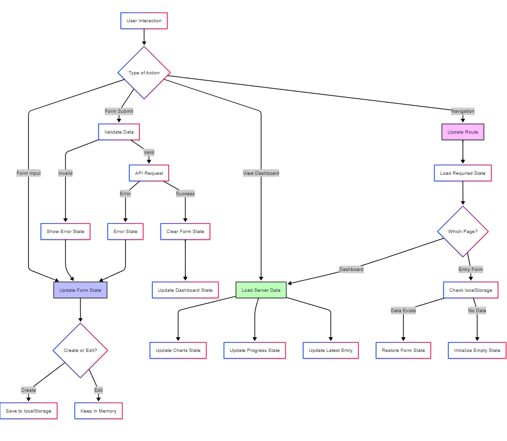

# State Management

## Overview

The application implements a comprehensive state management system that handles form data, UI interactions, and data persistence across different views and user sessions.

## State Flow

The diagram above illustrates how state is managed throughout the application:

1. **User Interaction Types**
   - Form Input: Updates form state with validation
   - Form Submit: Processes data and updates multiple states
   - View Dashboard: Loads and updates dashboard-related states
   - Navigation: Manages route changes and state loading

2. **Form State Handling**
   - Updates form state on user input
   - Validates data before submission
   - Handles success/error states
   - Different behavior for Create vs Edit modes:
     - Create: Persists to localStorage
     - Edit: Maintains in memory only

3. **Dashboard State Management**
   - Loads server data on dashboard view
   - Updates multiple component states:
     - Charts state for visualizations
     - Progress state for metrics
     - Latest entry state for recent data

4. **Navigation State Flow**
   - Updates route on navigation
   - Loads required state based on page
   - Checks localStorage for form data
   - Initializes empty state when needed

## Real-time Updates

1. **Form Updates**
   - Immediate UI feedback
   - Progress indicators
   - Validation messages

2. **Dashboard Updates**
   - Auto-refresh on new entries
   - Progress calculations
   - Chart rerendering

This state management approach ensures data persistence between sessions, handles errors gracefully, and maintains a smooth user experience across the application.
